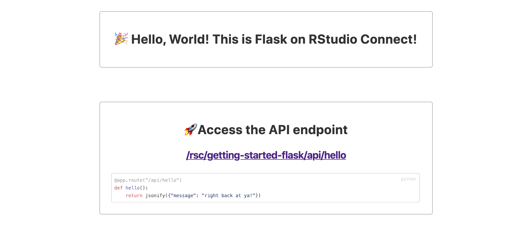

## Getting Started with Flask and Posit Connect

This application structure and set-up follows the steps outlined in the links below.

Two routes are defined:

- `/` renders an HTML template
- `/api/hello` returns a JSON object



## Usage

```bash
python -m venv .venv
. .venv/bin/activate
pip install -r requirements.txt
flask --app app run
```

## Deploy

### rsconnect-python CLI

```bash
rsconnect deploy api .
```

### Git-backed

Update the code, and then run:

```bash
rsconnect write-manifest api --overwrite .
```

Commit the new `manifest.json` file to the git repo along with the code.

#### Resources

- [Posit Connect User Guide: Flask](https://docs.posit.co/connect/user/flask/)
- [Getting Started with Flask and Posit Connect](https://support.rstudio.com/hc/en-us/articles/360044700234)
- [Deploying Flask Applications to Posit Connect with Git and rsconnect-python](https://support.rstudio.com/hc/en-us/articles/360045224233)
- [Using Templates and Static Assets with Flask Applications on Posit Connect](https://support.rstudio.com/hc/en-us/articles/360045279313)
