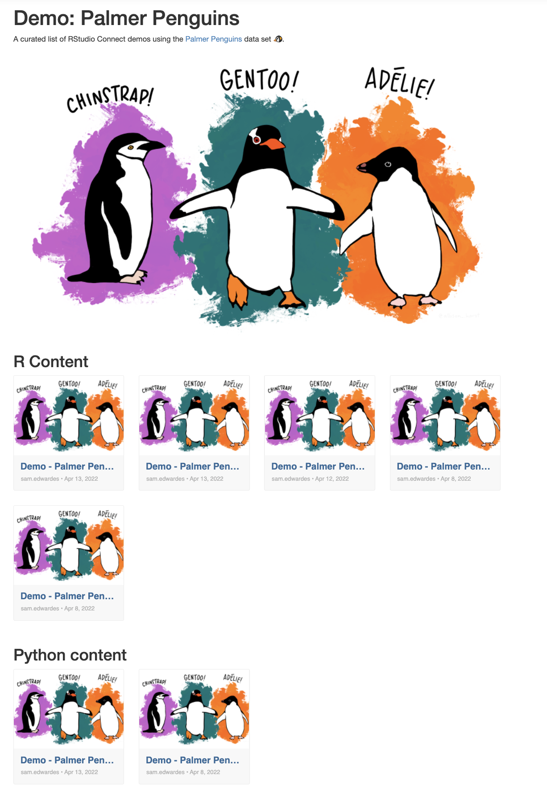

# Using connectwidgets with Posit Connect

A demo of connect widgets in RStudio Connect.



## Environment variable requirements

This content needs to have the following environment variables set to function:
- `CONNECT_SERVER` the URL of your Connect server, for Test Drive it will be in this format: https://YOUR_DOMAIN_HERE.eval.posit.co/cnct
- `CONNECT_API_KEY` an API key from your Connect server. See [API Keys](https://docs.posit.co/connect/user/api-keys/) in the Connect User guide for more information.
 
Variables can be saved in an .Renviron config file when working with this project. [`usethis`](https://usethis.r-lib.org/) has a function for creating and editing .Renviron files: 

```r
library(usethis)
usethis::edit_r_environ()
```

Add the variables to that file in the format `KEY=VALUE` and save it. Restart the session so the new environment variables will be loaded with `ctrl shift f10` or through the RStudio IDE through the **Session** dropdown and selecting **Restart R**.

## Usage

Setup the `renv` environment:

```r
renv::activate()
renv::restore()
```

To render the dashboard either use the "Knit" button on the top of the IDE code pane and select "Knit to HTML" or use:

```r
rmarkdown::render("app/report.Rmd")
```

## Deployment

### Push Button

Use the blue publish icon in the upper right corner of the IDE code pane.

### rsconnect package

You can also deploy using the rsconnect package:

```
rsconnect::deployDoc(
  doc = "app/report.Rmd",
  appTitle = "Connect Widget Example"
)
```

### Git-backed

Update the code, and then run:

```r
rsconnect::writeManifest(
  "app", 
  appFiles = c("report.Rmd", "imgs")
)
```

Commit the new `manifest.json` file to the git repo along with the code.

## Resources

[Posit Connect How-to Guide: Custom Landing Page with connectwidgets](https://docs.posit.co/connect/how-to/connectwidgets/index.html#connectwidgets)
